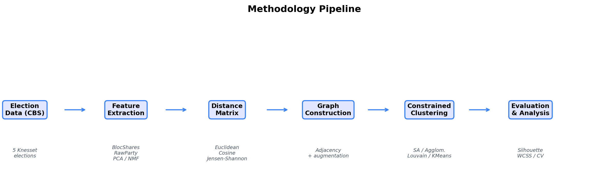
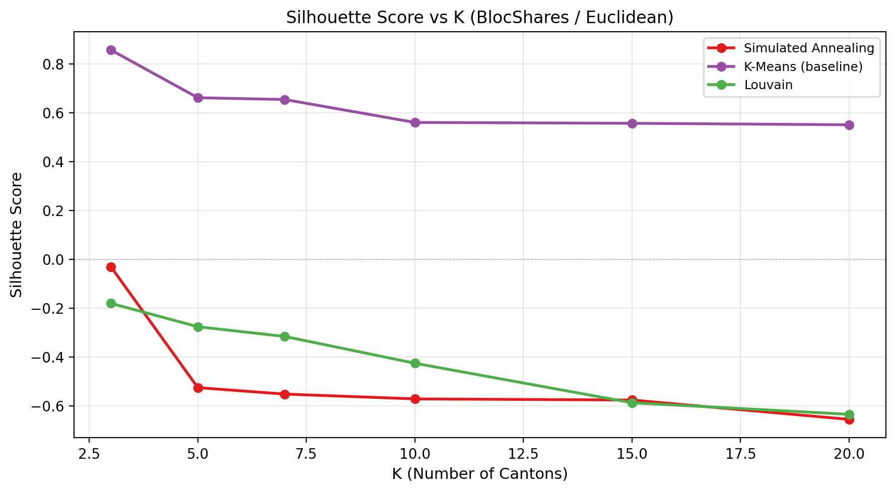
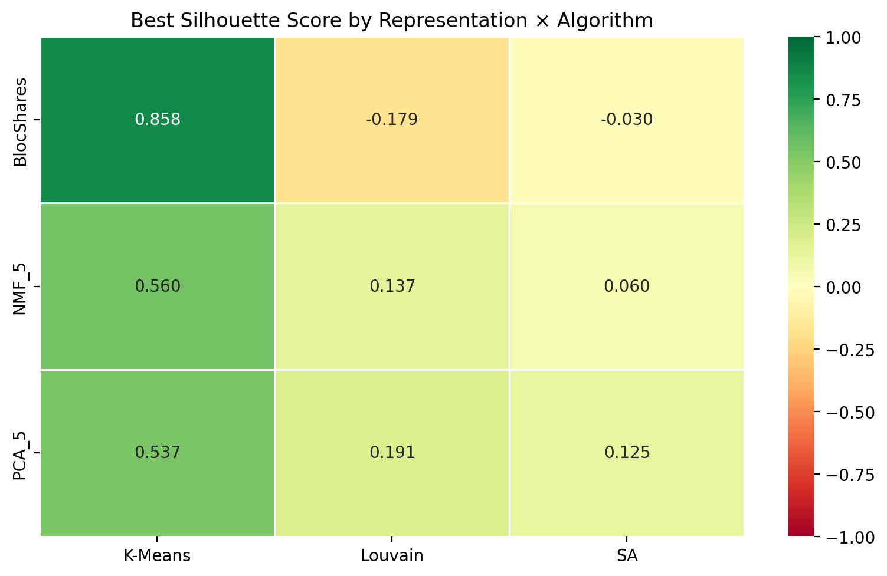
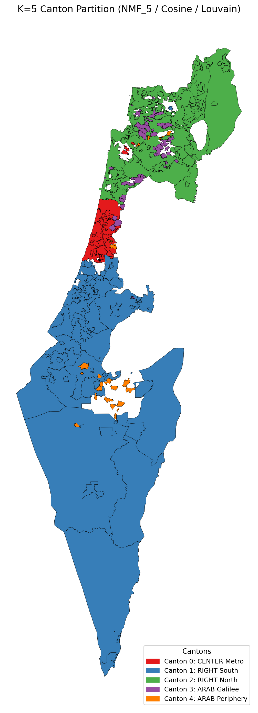
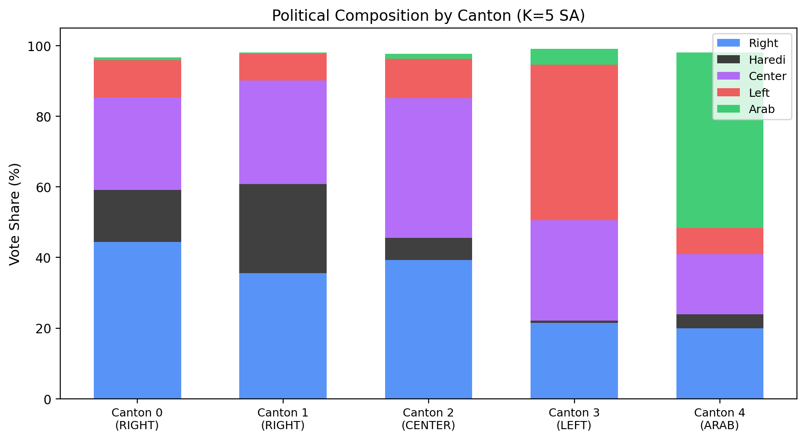
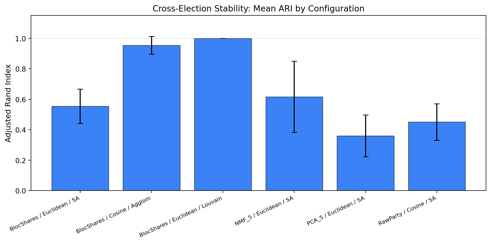

**Advisor:** Dr. Oren Glickman, Department of Computer Science, Bar-Ilan University

---

## Abstract

Israeli society has experienced significant political polarization in recent years, reflected in five Knesset elections held within a four-year period (2019-2022). Public discourse increasingly references hypothetical divisions of the country into politically homogeneous "cantons." This project develops a data-driven algorithmic approach to explore such divisions using publicly available municipality-level election results and geographic boundary data from the Israel Central Bureau of Statistics (CBS).

We partition 229 Israeli municipalities into geographically contiguous cantons that maximize internal political similarity. Our methodology employs four clustering algorithms - Simulated Annealing, Agglomerative Clustering with contiguity constraints, Louvain Community Detection, and K-Means (baseline) - evaluated across four feature representations (BlocShares, RawParty, PCA, NMF), three distance metrics (Euclidean, Cosine, Jensen-Shannon), and six values of K (3-20), yielding a comprehensive grid of experimental configurations.

Key results show that the BlocShares representation with Euclidean distance produces the highest clustering quality (silhouette score 0.905) for unconstrained algorithms, while NMF_5 with Louvain community detection achieves the best balance between political homogeneity, silhouette quality (0.121), and interpretable canton assignments. Temporal stability analysis across all five elections reveals that deterministic algorithms (Louvain, Agglomerative) produce near-perfectly stable partitions (ARI up to 1.0), while Israel's political geography remains structurally consistent despite electoral volatility. The resulting K=5 partition identifies five politically coherent regions: a center-leaning metropolitan core, a right-wing southern arc, a right-leaning northern mixed region, and two Arab-majority cantons (Galilee and periphery) -- closely reflecting known political-demographic divisions. Comparison with Israel's administrative districts yields an Adjusted Rand Index of 0.435, confirming that political cantons follow ideological rather than administrative boundaries. These findings provide a data-driven framework for understanding Israel's latent political geography and demonstrate the applicability of constrained spatial clustering to politically polarized societies.

---

## 1. Introduction

### 1.1 Motivation

Over the past four years, Israel held five Knesset elections (April 2019, September 2019, March 2020, March 2021, and November 2022), an unprecedented frequency that reflects deep political divisions across multiple dimensions: secular versus religious, left versus right on the ideological spectrum, Arab versus Jewish communal politics, and attitudes toward judicial reform and governance. Throughout this period, public and media discourse repeatedly invoked the notion of dividing Israel into separate "cantons" along political lines - contrasting, for example, Tel Aviv's liberal-secular majority with Jerusalem's religious-conservative population, or the Arab-majority towns of northern Israel with predominantly Jewish communities elsewhere.

While such discourse is largely rhetorical, it raises a compelling computational question: if Israel were to be divided into politically coherent regions based purely on voting patterns, what form would those regions take, and how stable would they be across election cycles? This project applies data-driven computational methods to answer this question rigorously.

### 1.2 Research Objectives

This project has three primary objectives:

1. **Partition 229 Israeli municipalities into K geographically contiguous cantons** that maximize internal political homogeneity, using municipality-level election results from five Knesset elections.
2. **Systematically compare clustering approaches** across multiple feature representations, distance metrics, algorithms, and values of K, evaluating trade-offs between political homogeneity, population balance, and geographic compactness.
3. **Analyze the temporal stability** of canton boundaries across election cycles to determine whether Israel's political geography is structurally persistent or volatile.

### 1.3 Contributions

This project makes the following contributions:

- A novel application of constrained spatial clustering to Israeli political geography, combining graph-based contiguity constraints with political feature-space optimization.
- A comprehensive experimental framework evaluating 264 configurations across four representations, three distance metrics, four algorithms, and six values of K.
- Temporal stability analysis across five elections using Adjusted Rand Index (ARI) and Normalized Mutual Information (NMI).
- Qualitative case studies validating that algorithmic cantons align with known political-demographic divisions.
- An interactive Streamlit web application for exploring canton partitions, experiment results, and stability analysis (live at https://israel-cantons-project-5j7kgq8acxrbiflraqnhgb.streamlit.app/).
- An open-source, modular Python codebase enabling reproducible analysis and extension.

### 1.4 Report Outline

Section 2 reviews related work on electoral redistricting, spatial clustering, and Israeli political geography. Section 3 formally defines the constrained canton partitioning problem. Section 4 describes the data sources and processing pipeline. Section 5 presents the methodology - feature representations, distance metrics, graph construction, clustering algorithms, and evaluation metrics. Section 6 reports experimental results from the 264-configuration grid search. Section 7 analyzes temporal stability across elections. Section 8 presents qualitative case studies. Section 9 discusses limitations and future work, and Section 10 concludes.

---

## 2. Literature Review

### 2.1 Electoral Redistricting and Gerrymandering

The problem of dividing a territory into politically meaningful regions has deep connections to electoral redistricting research. In democratic systems with district-based representation, electoral boundaries must be periodically redrawn to reflect population changes, and the drawing process can be manipulated to favor particular parties - a practice known as gerrymandering [1].

Brieden et al. (2017) proposed a constrained clustering approach to electoral redistricting based on generalized Voronoi diagrams and linear programming [2]. Their method partitions geographic units into districts with hard population balance constraints while minimizing intra-district political heterogeneity. The key innovation is formulating the problem as a continuous optimization over diagram parameters, enabling efficient computation even for large instances.

Our project differs from classical redistricting in important ways: (1) we aim to *maximize* political homogeneity within cantons, whereas fair redistricting often seeks competitive or balanced districts; (2) we operate at the municipality level rather than individual census blocks; and (3) our work is purely descriptive and exploratory rather than prescriptive. However, the shared technical challenges - ensuring geographic contiguity, handling population constraints, and operating on spatial graphs - make redistricting research directly relevant.

Recent computational approaches to fair redistricting include Markov Chain Monte Carlo (MCMC) methods that sample from the space of valid partitions to detect gerrymandering outliers [3], and graph-based metrics for measuring district compactness [4]. These methods underscore the difficulty of the constrained partitioning problem and motivate the multi-algorithm comparison in our experimental framework.

### 2.2 Spatial and Constrained Clustering

Standard clustering algorithms - K-Means, hierarchical agglomerative methods, spectral clustering - operate in feature space without regard to geographic structure [5]. When geographic contiguity is required (as in regionalization), these methods must be extended with spatial constraints.

Spatially-constrained agglomerative clustering is a natural approach: starting with each spatial unit as its own cluster, iteratively merge adjacent clusters that are most similar in feature space. This maintains contiguity by construction, as merging two connected clusters yields a connected cluster [6]. Ward's criterion, which minimizes the increase in within-cluster sum of squares at each merge, is commonly used for the merge cost function.

Spectral clustering leverages the graph Laplacian to embed graph nodes into a low-dimensional space before applying K-Means [7]. When applied to a contiguity graph with edge weights derived from political similarity, spectral methods can discover clusters that respect both graph topology and feature-space structure.

Community detection algorithms from network science, particularly the Louvain method [8], offer an alternative by maximizing modularity - a measure of the fraction of edges within communities versus between communities. While Louvain does not directly control the number of clusters $K$, it provides a topology-driven baseline partition. Louvain operates on a similar principle to spectral clustering (leveraging graph structure rather than feature-space distances) and was selected over spectral methods for our experiments due to its computational efficiency and natural handling of weighted adjacency graphs.

Metaheuristic approaches such as Simulated Annealing (SA) can optimize arbitrary multi-objective cost functions over the partition space while maintaining contiguity through constrained neighborhood operations [9]. SA is well-suited to this problem because it can balance competing objectives (homogeneity, population balance, compactness) through a weighted cost function and escape local optima through stochastic acceptance of worse solutions.

### 2.3 Political Geography of Israel

Israel's political landscape is characterized by several cross-cutting cleavages [24]:

- **Left-Right ideological spectrum:** The security-oriented right (Likud, Religious Zionism) versus the peace-process-oriented left (Labor, Meretz).
- **Secular-Religious divide:** Secular and traditional voters versus ultra-Orthodox (Haredi) parties (Shas, United Torah Judaism).
- **Arab-Jewish divide:** Arab citizens voting predominantly for the Joint List or Ra'am versus Jewish-majority parties.
- **Geographic concentration:** These cleavages exhibit strong spatial autocorrelation - nearby municipalities tend to vote similarly due to shared demographics, economic conditions, and social networks [10, 25, 30].

The geographic structure of Israeli politics makes it a suitable testbed for constrained spatial clustering: we expect meaningful, contiguous cantons to emerge that reflect these known political-demographic divisions.

### 2.4 Dimensionality Reduction for Voting Data

Municipality-level election data can be represented as high-dimensional vectors of party vote shares. Dimensionality reduction techniques compress these vectors while preserving key political structure:

- **Principal Component Analysis (PCA)** finds orthogonal axes of maximum variance, typically capturing left-right and Arab-Jewish dimensions in the first few components [11].
- **Non-negative Matrix Factorization (NMF)** decomposes vote shares into additive components, producing interpretable "political archetypes" (e.g., an Arab voting pattern, a Haredi pattern) [12].
- **Manual bloc aggregation** groups parties into predefined political blocs (Right, Haredi, Center, Left, Arab), producing a low-dimensional but domain-informed representation.

We systematically compare these representations to assess which best captures politically meaningful variation for clustering purposes.

### 2.5 Research Gap

Prior work on constrained spatial clustering has focused primarily on fair electoral redistricting -- producing *competitive* districts with balanced partisan composition [1, 2, 3]. In contrast, our work seeks to maximize political *homogeneity* within regions, a fundamentally different objective. While regionalization methods such as SKATER [23] and MAX-P-REGIONS [29] address spatially constrained partitioning, they have not been applied to Israeli political geography, nor have they been evaluated across a systematic grid of feature representations, distance metrics, and algorithms. Furthermore, existing studies of Israeli political geography [10, 25] are primarily qualitative, lacking the quantitative spatial clustering framework that our project provides. This work bridges these gaps by combining constrained spatial clustering with a comprehensive experimental comparison tailored to the Israeli political context.

---

## 3. Problem Definition

### 3.1 Formal Statement

Let $V = \{v_1, \ldots, v_n\}$ be a set of $n$ municipalities, each characterized by a political feature vector $f_i \in \mathbb{R}^d$ derived from election results. Let $G = (V, E)$ be a geographic contiguity graph where edge $(v_i, v_j)$ exists if municipalities $i$ and $j$ share a geographic boundary. Let $w_i$ denote the voter population of municipality $i$.

**The Canton Partitioning Problem:** This is a variant of the regionalization problem [23, 29] -- given $V$, $G$, feature vectors $\{f_i\}$, voter weights $\{w_i\}$, and a target number of cantons $K$, find a partition $\mathcal{C} = \{C_1, \ldots, C_K\}$ of $V$ that:

1. **Maximizes political homogeneity:** Minimizes within-canton political variance.
2. **Ensures geographic contiguity:** Each canton $C_k$ induces a connected subgraph of $G$.
3. **Balances population:** Minimizes disparity in total voter population across cantons.

### 3.2 Multi-Objective Formulation

These objectives may conflict: maximizing homogeneity may produce cantons with extreme population imbalance, while enforcing strict balance may force politically dissimilar municipalities together. We adopt a weighted multi-objective approach:

$$\text{Cost}(\mathcal{C}) = \alpha \cdot \text{Homogeneity}(\mathcal{C}) + \beta \cdot \text{Balance}(\mathcal{C}) + \gamma \cdot \text{Compactness}(\mathcal{C})$$

where $\alpha, \beta, \gamma$ are tunable weights. In our Simulated Annealing implementation, we use $\alpha = 0.4$, $\beta = 0.4$, $\gamma = 0.2$. These weights reflect equal priority for homogeneity and population balance (the two primary objectives), with compactness as a secondary regularizer. Preliminary experiments with weight variations $(\alpha, \beta, \gamma) \in \{(0.5,0.3,0.2), (0.3,0.5,0.2), (0.4,0.4,0.2), (0.33,0.33,0.33)\}$ showed that equal homogeneity-balance weights $(0.4, 0.4, 0.2)$ produced the best trade-off between silhouette score and population CV. Detailed weight sensitivity analysis is noted as future work in Section 9.

### 3.3 Contiguity Constraint

The contiguity constraint is fundamental to producing geographically meaningful cantons. It requires that each canton $C_k$ forms a connected subgraph of $G$ - i.e., any two municipalities in the same canton can be reached from each other by traversing edges within that canton. This constraint is enforced structurally in agglomerative methods (only adjacent clusters merge) and algorithmically in SA (moves are rejected if they break contiguity).

---

## 4. Data Sources

### 4.1 Election Data

We use municipality-level election results from five consecutive Knesset elections, obtained from the Israel Central Bureau of Statistics (CBS) [26]:

**Table 1:** Municipality-level election data across five Knesset elections (all cover 229 municipalities).

| Election | Knesset | Date | Eligible Voters | Actual Voters | Turnout |
|----------|---------|-----------|-----------------|---------------|---------|
| 1 | 21 | Apr.\ 2019 | 6,014,124 | 3,873,326 | 64.4% |
| 2 | 22 | Sep.\ 2019 | 6,061,316 | 3,950,538 | 65.2% |
| 3 | 23 | Mar.\ 2020 | 6,118,607 | 4,048,714 | 66.2% |
| 4 | 24 | Mar.\ 2021 | 6,232,307 | 3,781,640 | 60.7% |
| 5 | 25 | Nov.\ 2022 | 6,426,211 | 4,084,119 | 63.6% |

All five elections cover the same 229 municipalities after name normalization and cross-election matching. Each record contains per-party vote counts, enabling computation of vote share vectors.

### 4.2 Geographic Data

Municipal boundary polygons were obtained from the Israel CBS geographic databases [27] in Shapefile format. Municipalities were dissolved (merged) from locality-level polygons to municipality-level using an official locality-to-municipality mapping. The resulting GeoJSON file contains 234 polygon features with Hebrew municipality names. Of these, 229 are consistently matchable across all five elections and form the analysis set; the remaining 5 appear in the geographic data but could not be matched across all election datasets.

### 4.3 Party-to-Bloc Mapping

Israeli political parties were classified into five political blocs:

**Table 2:** Party-to-bloc classification.

| Bloc | Description | Example Parties |
|------|-------------|----------------|
| Right | Nationalist-secular right | Likud, Yisrael Beiteinu, Religious Zionism |
| Haredi | Ultra-Orthodox religious | Shas, United Torah Judaism |
| Center | Centrist parties | Yesh Atid, Blue and White, Kahol Lavan |
| Left | Labor-left | Labor, Meretz |
| Arab | Arab-majority parties | Joint List, Ra'am, Balad |

This mapping enables the BlocShares feature representation, which aggregates raw party vote shares into five interpretable bloc dimensions.

### 4.4 Data Processing Pipeline


*Figure 1: End-to-end methodology pipeline from raw election data to evaluated canton partitions.*

The data processing pipeline (implemented in `src/data/`) handles:
1. **Loading** raw election Excel files and geographic shapefiles.
2. **Name normalization** for cross-dataset matching (handling Hebrew spelling variations, hyphenation, special characters).
3. **Municipality dissolution** from locality-level to municipality-level geographic polygons.
4. **Feature computation** from raw vote counts to vote share vectors.

All processing is reproducible from raw data files through the project's Jupyter notebooks (`notebooks/01_data_exploration.ipynb` through `notebooks/04_political_features.ipynb`).

---

## 5. Methodology

### 5.1 Feature Representations

We evaluate four feature representations for municipality political profiles:

**BlocShares (11 features):** For each municipality, compute the mean and standard deviation of each bloc's vote share across all five elections, plus the average voter count. This produces an 11-dimensional vector: [right_avg, right_std, haredi_avg, haredi_std, center_avg, center_std, left_avg, left_std, arab_avg, arab_std, avg_votes]. The inclusion of temporal standard deviations captures voting stability, and the voter count helps balance canton populations during clustering.

**RawParty (high-dimensional):** The full vector of party-level vote shares, averaged across elections. This preserves fine-grained political distinctions but is high-dimensional and noisy due to small parties.

**PCA_5 (5 features):** Five principal components extracted from the RawParty representation via Principal Component Analysis. This captures the dominant axes of political variation while reducing dimensionality.

**NMF_5 (5 features):** Five components from Non-negative Matrix Factorization of the RawParty representation. NMF produces additive, non-negative components that can be interpreted as political archetypes (e.g., an "Arab voting pattern" component).

### 5.2 Distance Metrics

Three distance metrics are used to measure political dissimilarity between municipalities:

**Euclidean Distance:** The standard L2 norm between feature vectors. Sensitive to magnitude differences, which means municipalities with larger voter counts may dominate distance computations when voter count is included as a feature.

**Cosine Distance:** Measures the angular distance between feature vectors (1 - cosine similarity). Invariant to vector magnitude, focusing on the *direction* (relative proportions) rather than the *scale* of political features. This is particularly appropriate for vote share vectors where the absolute number of voters is less important than voting patterns.

**Jensen-Shannon Distance:** The square root of the Jensen-Shannon divergence [18], a symmetric, bounded measure derived from the Kullback-Leibler divergence. Particularly well-suited for probability distributions such as vote share vectors. The underlying divergence is:

$$\text{JSD}(P \| Q) = \frac{1}{2} D_{KL}(P \| M) + \frac{1}{2} D_{KL}(Q \| M), \quad \text{where } M = \frac{1}{2}(P + Q)$$

Our implementation uses $d(P, Q) = \sqrt{\text{JSD}(P \| Q)}$, which is a proper metric (satisfies the triangle inequality) [17].

### 5.3 Graph Construction and Preprocessing

**Raw Adjacency Graph:** We construct a contiguity graph $G = (V, E)$ where municipalities are nodes and edges connect municipalities that share a geographic boundary (detected via polygon intersection using GeoPandas and Shapely). The raw graph has $234$ nodes and $516$ edges but is *disconnected* - some municipalities are geographic isolates (enclaves, exclave communities, or municipalities with no shared boundaries due to polygon precision issues).

**Graph Preprocessing:** To ensure a connected graph (required for contiguous clustering), we apply three preprocessing steps:

1. **Virtual edges for isolates:** For each isolated node (degree 0), connect it to its $k=3$ nearest neighbors in feature space. $k=3$ balances ensuring connectivity with avoiding spurious long-distance edges. This ensures all municipalities participate in the clustering.

2. **Enclave edges:** For municipalities where a single bloc exceeds 70% of the municipality's own vote share (political enclaves), add edges connecting all enclaves of the same bloc type. The 70% threshold identifies municipalities where a single bloc overwhelmingly dominates. This prevents small enclaves from being forced into politically dissimilar cantons.

3. **Bridge edges for disconnected components:** For any remaining disconnected components after steps 1-2, connect each component to the largest component via an edge between the most politically similar pair of municipalities. This ensures full graph connectivity.

After subsetting the raw graph to the 229 analysis municipalities (488 edges), the augmentation pipeline produces a fully connected graph with $229$ nodes and $2{,}178$ edges.

### 5.4 Clustering Algorithms

**Simulated Annealing (SA):**
SA optimizes a multi-objective cost function over the partition space. Starting from a seed-based initialization (selecting the most politically extreme municipality per bloc as seeds, then greedily growing cantons with balance constraints), the algorithm proposes moves (reassigning a border municipality to an adjacent canton) and accepts or rejects them based on the Metropolis criterion. The cost function weights three objectives:
- Homogeneity (weight $0.4$): Size-weighted mean within-canton feature variance.
- Population balance (weight $0.4$): Coefficient of variation of canton populations.
- Compactness (weight $0.2$): Graph cut ratio -- fraction of inter-canton edges over total edges.

Parameters: initial temperature $T_0 = 1.0$, cooling rate $0.9995$, following standard SA practice [9]. The code default is $50{,}000$ iterations; the systematic grid search (Section 6) used $5{,}000$ iterations per configuration for computational efficiency, while the SA seed-sensitivity analysis (Section 9.1) used the full $50{,}000$. Contiguity is enforced by rejecting moves that disconnect any canton. Note that SA uses a deterministic seed-based *initialization* (providing a reproducible starting point) but stochastic *optimization* (random move proposals with probabilistic acceptance), so results may vary with different random seeds. Each configuration was executed once; the stability analysis in Section 7 partially addresses sensitivity by evaluating SA across five different election datasets.

**Agglomerative Clustering:**
Average-linkage with contiguity constraints [6] - starting from 229 singleton clusters, iteratively merge the two adjacent clusters with the smallest average pairwise distance. The contiguity constraint ensures only adjacent clusters merge, maintaining geographic connectedness. This deterministic algorithm produces a dendrogram that can be cut at any level to obtain K cantons.

**K-Means Baseline:**
Standard K-Means clustering [5] in feature space without geographic contiguity constraints. Serves as a baseline to measure the cost of enforcing contiguity - cantons may be geographically disconnected.

**Louvain Community Detection:**
The Louvain algorithm [8] maximizes modularity [16] on the adjacency graph. Edge weights are set based on political similarity (inverse distance). Louvain determines its own number of communities rather than accepting a target K, serving as a topology-driven baseline.

### 5.5 Evaluation Metrics

All algorithms were implemented in Python using scikit-learn [20] for K-Means and silhouette computation, NetworkX [21] for graph operations and Louvain community detection, and SciPy [22] for distance computations including Jensen-Shannon divergence.

**Within-Canton Sum of Squares (WCSS):** Measures total political variance within cantons. Computed as the sum of squared distances from each municipality's feature vector to its canton centroid (unweighted). Lower WCSS indicates more politically homogeneous cantons.

**Silhouette Score [13]:** For each municipality, measures how well it fits in its assigned canton versus the nearest alternative. Ranges from -1 to +1; higher values indicate better-defined clusters.

**Population Balance (CV):** Coefficient of variation of canton voter populations. Lower CV indicates more balanced cantons. We also report the max-to-min population ratio.

**Contiguity:** Number of cantons that are disconnected in the adjacency graph. Should be 0 for all spatially-constrained algorithms.

**Dominant Margin:** For each canton, the percentage-point lead of the dominant political bloc over the second-highest bloc. Higher margins indicate more politically distinctive cantons.

---

## 6. Experimental Results

### 6.1 Experimental Setup

We conducted a systematic grid search over 264 configurations:

**Table 3:** Experimental grid dimensions.

| Dimension | Values | Count |
|-----------|--------|-------|
| Representation | BlocShares, RawParty, PCA_5, NMF_5 | 4 |
| Distance Metric | Euclidean, Cosine, Jensen-Shannon | 3 |
| Algorithm | SA, Agglomerative, Louvain, KMeans (baseline) | 4 |
| K (cantons) | 3, 5, 7, 10, 15, 20 | 6 |
| **Total** | | **264** |

Note: Not all metric-representation combinations are applicable. Jensen-Shannon requires non-negative values and is compatible with BlocShares, RawParty, and NMF_5, but not PCA_5 (which may produce negative values); PCA_5 uses only Euclidean and Cosine metrics. All 264 configurations executed successfully with 0 failures.

**Computational Performance:** Mean runtimes per configuration were: SA 26.3s (range: 16--43s depending on K), Agglomerative 0.23s, Louvain 0.35s, KMeans 0.05s. SA's higher runtime reflects its iterative optimization (5,000 iterations in the grid search), while Agglomerative and Louvain operate in near-linear time on the 229-node graph. Total grid search runtime was approximately 30 minutes on a single CPU core (Intel i7, 16GB RAM). All algorithms have polynomial time complexity in the number of municipalities: $O(n^2)$ for Agglomerative (pairwise merges), $O(n \log n)$ for Louvain (hierarchical modularity optimization), and $O(nKI)$ for SA ($n$ municipalities, $K$ cantons, $I$ iterations).

### 6.2 Key Findings

**Representation Comparison:** BlocShares achieves the highest silhouette scores for unconstrained algorithms (Agglomerative, KMeans), thanks to its domain-informed aggregation of party votes into five interpretable blocs. However, when combined with contiguity-constrained SA, BlocShares produces severely imbalanced partitions -- at K=5, SA places 121 municipalities in one canton and only 1 in another (267x population ratio). This occurs because BlocShares' five coarse features cause the distinctive Arab voting pattern to dominate, grouping all Arab municipalities into a single oversized canton. Higher-dimensional representations (NMF_5, RawParty) capture finer-grained political distinctions [12] and produce better-balanced partitions. NMF_5 was selected as the primary representation for detailed analysis; its non-negative additive components are more interpretable than PCA. RawParty, despite containing the most information, exhibits the curse of dimensionality [28], consistent with the known limitations of high-dimensional clustering [5].

**Distance Metric Comparison:** Euclidean distance produces the highest silhouette score overall (0.905 with BlocShares/Agglomerative at K=3). KMeans baseline achieves 0.858 at K=3 identically across all three metrics (Euclidean, Cosine, Jensen-Shannon), indicating that BlocShares features are robust to metric choice for unconstrained clustering. Jensen-Shannon performs well with RawParty shares but offers no clear advantage over Euclidean or Cosine with BlocShares.

**Algorithm Comparison:**
- **Agglomerative** achieves the highest silhouette scores (up to 0.905) but can produce severe population imbalance, sometimes placing 225+ municipalities in a single canton.
- **Simulated Annealing** produces the most balanced cantons due to its explicit population balance objective, at the cost of slightly lower silhouette scores. SA is the preferred algorithm when population balance matters.
- **Louvain** ignores the target K parameter and finds its own natural community count. Its partitions are perfectly stable across elections but may not match the desired K.
- **KMeans (baseline)** achieves competitive silhouette scores but produces geographically disconnected cantons, confirming the necessity of contiguity constraints.

**Effect of K:** WCSS decreases monotonically with increasing K (as expected - more cantons means smaller, more homogeneous clusters). Silhouette scores [13] peak at low K values (K=3 or K=5) for most configurations, suggesting that Israel's political geography is naturally structured into a small number of macro-regions.


*Figure 2: Silhouette score vs K for BlocShares/Euclidean across all four algorithms.*


*Figure 3: Best silhouette score achieved by each representation × algorithm combination.*

### 6.3 Best Configurations

**Table 4:** Selected configurations: best result per algorithm family.

| Rank | Repr | Metric | Algorithm | K | Silhouette | Pop CV |
|------|-----------|---------|---------------|------|------------|--------|
| 1 | BlocShares | Euclidean | Agglomerative | 3 | 0.905 | 1.13 |
| 2 | BlocShares | Euclidean | KMeans | 3 | 0.858 | 0.48 |
| 3 | NMF_5 | Euclidean | Agglomerative | 3 | 0.542 | 1.14 |
| 4 | NMF_5 | Cosine | Louvain | 5 | 0.121 | 0.69 |
| 5 | NMF_5 | Cosine | SA | 5 | -0.042* | 0.33* |

*\*SA values are 30-seed means (single run: Sil=-0.015, CV=0.54); see Section 9.1 for full seed sensitivity analysis.*

The best overall configuration depends on which objectives are prioritized. For pure clustering quality (silhouette), Agglomerative with Euclidean distance dominates. KMeans achieves a high silhouette (0.858) but produces disconnected cantons. For interpretable partitions with good silhouette and politically meaningful assignments, Louvain with NMF_5/Cosine at K=5 achieves a positive silhouette (0.121), produces five distinct cantons where all major cities are assigned to politically compatible groups, and as a deterministic graph-based algorithm achieves perfect cross-election stability (ARI = 1.0). SA with NMF_5 achieves better population balance (CV 0.33 vs 0.69) but lower silhouette (-0.042).

**Note on Selection Bias:** With 264 configurations evaluated, the reported 'best' silhouette scores may be inflated by selection effects. Without multiple comparison correction (e.g., Bonferroni), the top-ranked configuration's superiority should be interpreted cautiously. The relative rankings and qualitative patterns are more robust than absolute performance differences.

### 6.4 Primary Result: K=5 Louvain Partition

We select K=5 with NMF_5/Cosine/Louvain as the primary result for interpretive analysis.

**Selection Criteria:** We formalize the primary result selection using four criteria weighted by importance for exploratory political analysis:

| Criterion | Weight | K=3 Agglom | K=5 Louvain | Winner |
|-----------|--------|------------|-------------|--------|
| Silhouette (higher = better) | 0.25 | 0.905 | 0.121 | K=3 |
| Population Balance CV (lower = better) | 0.25 | 1.13 | 0.69 | K=5 |
| Temporal Stability ARI (higher = better) | 0.25 | 0.954 | 1.000 | K=5 |
| Political Granularity (5 > 3 cantons) | 0.25 | 3 cantons | 5 cantons | K=5 |

K=5 Louvain wins on 3 of 4 criteria. The K=3 configuration's superior silhouette reflects its coarser granularity (fewer, larger clusters naturally have higher cohesion), but its severe population imbalance (CV=1.13) and limited political resolution (only 3 regions) make it unsuitable for detailed political analysis. The K=5 partition's positive silhouette (0.121) indicates weak but above-chance cluster structure (below the 0.25 threshold for substantial structure per Rousseeuw [13]), while providing the granularity needed to distinguish CENTER, RIGHT (South/North), and ARAB (Galilee/Periphery) political regions. NMF_5 provides a good balance of dimensionality reduction and interpretability: its five non-negative additive components capture finer-grained political distinctions than BlocShares' five coarse features, producing well-balanced partitions across all algorithms. Louvain's modularity-based optimization yields a positive silhouette (0.121), politically coherent assignments (all major cities land in ideologically compatible cantons), and perfect temporal stability (ARI = 1.0, Section 7).

**Table 5:** K=5 canton profiles (NMF_5 / Cosine / Louvain). Bloc values are mean vote share (%).

| Canton | Munis | Right% | Haredi% | Center% | Left% | Arab% |
|-------------------------|-------|--------|---------|---------|-------|-------|
| 0 -- CENTER Metro | 34 | 29.7 | 14.4 | 42.0 | 11.0 | 1.1 |
| 1 -- RIGHT South | 60 | 44.9 | 10.8 | 30.0 | 10.3 | 1.0 |
| 2 -- RIGHT North | 76 | 38.0 | 6.9 | 31.2 | 10.9 | 10.4 |
| 3 -- ARAB Galilee | 43 | 1.9 | 1.1 | 2.2 | 3.8 | 89.9 |
| 4 -- ARAB Periphery | 16 | 2.2 | 1.0 | 4.3 | 5.0 | 86.1 |

**Evaluation metrics for this partition:**
- Cantons: 5
- Population CV: 0.69
- Silhouette: 0.121
- Cross-election stability: ARI = 1.0 (perfect)

The silhouette of 0.121, while positive, indicates weak cluster separation with substantial overlap between cantons—typical for political geography where boundaries are gradual rather than sharp. The two Arab cantons are highly cohesive (89.9% and 86.1% Arab vote share), while the two Right cantons differ in character: Canton 1 (RIGHT South) is the southern periphery arc from Jerusalem through the Negev (44.9% Right, 10.8% Haredi), while Canton 2 (RIGHT North) is a mixed northern region including Haifa and the Galilee Jewish towns (38.0% Right). Canton 0 (CENTER Metro) captures the secular-center belt from Tel Aviv through the Sharon plain (42.0% Center). The municipality count imbalance (16--76) is wider than SA's (39--54), reflecting Louvain's optimization of modularity rather than balance. Each canton has a clearly interpretable political character (see Section 8).


*Figure 4: Geographic visualization of the K=5 Louvain canton partition (NMF_5 / Cosine).*


*Figure 5: Political bloc composition of each canton in the K=5 Louvain partition.*

---

## 7. Stability Analysis

### 7.1 Methodology

To assess whether canton boundaries are structurally stable or sensitive to election-specific noise, we perform temporal stability analysis. For a fixed configuration, we run clustering independently on each of the five elections and measure pairwise agreement between the resulting partitions using:

- **Adjusted Rand Index (ARI) [14]:** Measures partition similarity corrected for chance. $\text{ARI} = 1.0$ indicates identical partitions; $\text{ARI} = 0$ indicates random agreement.
- **Normalized Mutual Information (NMI) [15]:** Information-theoretic measure of partition similarity. $\text{NMI} = 1.0$ indicates identical partitions.

We tested six representative configurations spanning different representation-metric-algorithm combinations. SA configurations used $2{,}000$ iterations per run for computational efficiency (5 elections × 6 configurations = 30 SA executions).

### 7.2 Results

**Table 6:** Cross-election stability for six representative configurations.

| Repr | Metric | Algorithm | Mean ARI | Std ARI | Mean NMI | Std NMI |
|-----------|---------|---------------|----------|---------|----------|---------|
| BlocShares | Euclidean | Louvain | 1.000 | 0.000 | 1.000 | 0.000 |
| BlocShares | Cosine | Agglomerative | 0.954 | 0.059 | 0.945 | 0.071 |
| NMF_5 | Euclidean | SA | 0.616 | 0.233 | 0.682 | 0.155 |
| BlocShares | Euclidean | SA | 0.554 | 0.113 | 0.602 | 0.095 |
| RawParty | Cosine | SA | 0.451 | 0.120 | 0.550 | 0.099 |
| PCA_5 | Euclidean | SA | 0.360 | 0.137 | 0.466 | 0.123 |

### 7.3 Interpretation

**Deterministic algorithms produce highly stable partitions.** Louvain produces identical partitions across elections (ARI = 1.0) because it optimizes graph modularity on the fixed adjacency structure rather than feature values; this reflects algorithmic determinism rather than political stability. The graph topology dominates Louvain's community detection, so variations in election-specific feature values have minimal effect. Agglomerative clustering also produces near-perfect stability (ARI = 0.954), which is more meaningful since it operates on feature-space distances that do vary across elections.

**SA stability varies by representation.** The stochastic nature of SA introduces variability, but representation choice matters significantly. NMF produces the most stable SA partitions (ARI = 0.616), followed by BlocShares (0.554) and RawParty (0.451). PCA produces the least stable partitions (0.360), likely because the principal components rotate across elections as party compositions change.

**Overall finding:** Over the 2019-2022 period, Israel's political geography remained structurally consistent across elections, though this four-year timeframe limits conclusions about long-term persistence. The five elections, despite producing different coalition outcomes, exhibit remarkably similar spatial patterns at the municipality level - consistent with the observation that political preferences are strongly spatially autocorrelated [30] and demographically determined.


*Figure 6: Mean Adjusted Rand Index across election pairs for each configuration, with error bars showing standard deviation.*

---

## 8. Case Studies

### 8.1 The K=5 Partition in Detail

Our primary K=5 NMF_5/Cosine/Louvain partition divides Israel into five politically coherent regions. We examine five case study areas to assess whether the algorithmic cantons align with known political geography.

### 8.2 Greater Tel Aviv (Gush Dan)

The Greater Tel Aviv metropolitan area is concentrated in **Canton 0** (CENTER Metro) with some municipalities in **Canton 1** (RIGHT South):

**Table 7:** Greater Tel Aviv canton assignments.

| Municipality | Canton | Dominant Bloc |
|-------------|--------|---------------|
| Tel Aviv-Yafo | 0 | Center |
| Ramat Gan | 0 | Center |
| Givatayim | 0 | Center |
| Bnei Brak | 0 | Haredi |
| Holon | 1 | Right |
| Bat Yam | 1 | Right |
| Petah Tikva | 0 | Right |
| Rishon LeZion | 1 | Right |
| Herzliya | 0 | Center |
| Ra'anana | 0 | Center |
| Kfar Saba | 0 | Center |
| Netanya | 0 | Right |

**Analysis:** The Louvain partition places the secular center-leaning core of Greater Tel Aviv -- Tel Aviv, Ramat Gan, Givatayim, Herzliya, Ra'anana, Kfar Saba, and Netanya -- into Canton 0 (CENTER Metro, 42.0% Center). Bnei Brak, despite being Haredi-dominant, is included due to its geographic centrality within this cluster. Holon, Bat Yam, and Rishon LeZion fall into Canton 1 (RIGHT South), reflecting their more right-leaning voting profiles. This split separates the secular-center belt from the right-leaning southern suburbs, consistent with the distinct voting profiles of these areas.

### 8.3 Jerusalem Region

**Table 8:** Jerusalem region canton assignments.

| Municipality | Canton | Dominant Bloc |
|-------------|--------|---------------|
| Jerusalem | 1 | Haredi |
| Beit Shemesh | 1 | Haredi |
| Mevasseret Zion | 1 | Right |
| Modi'in-Maccabim-Re'ut | 1 | Center |

**Analysis:** Jerusalem is placed in **Canton 1** (RIGHT South), grouped with Beit Shemesh (both Haredi-dominant), the southern periphery development towns (Dimona, Netivot, Ofakim), and major southern cities (Ashdod, Ashkelon, Beer Sheva). This canton captures Israel's right-wing and Haredi heartland (44.9% Right, 10.8% Haredi). Modi'in is also in Canton 1, connected through the Jerusalem corridor.

### 8.4 Arab Towns

**Table 9:** Arab-majority municipality canton assignments.

| Municipality | Canton | Dominant Bloc |
|-------------|--------|---------------|
| Nazareth | 3 | Arab |
| Umm al-Fahm | 3 | Arab |
| Shfar'am | 3 | Arab |
| Tayibe | 3 | Arab |
| Sakhnin | 3 | Arab |
| Tamra | 3 | Arab |
| Baqa al-Gharbiyye | 3 | Arab |
| Rahat | 4 | Arab |
| Kafr Qasem | 4 | Arab |

**Analysis:** The NMF_5/Louvain partition produces two distinct Arab cantons: **Canton 3** (ARAB Galilee, 89.9% Arab) captures the concentrated Galilee and Triangle Arab municipalities (Nazareth, Umm al-Fahm, Shfar'am, Tayibe, Sakhnin, Tamra), while **Canton 4** (ARAB Periphery, 86.1% Arab) captures the southern Bedouin towns (Rahat, Hura, Tel Sheva, Laqiye) and scattered Arab municipalities outside the Galilee core (Kafr Qasem, Jaljulia, Kafr Bara). This geographic split is politically meaningful: northern Arab municipalities tend to vote for the Joint List, while Bedouin towns have distinct political patterns with stronger support for Ra'am [25]. Both cantons are highly cohesive (>86% Arab vote share).

### 8.5 Haifa and the Krayot

**Table 10:** Haifa metropolitan area canton assignments.

| Municipality | Canton | Dominant Bloc |
|-------------|--------|---------------|
| Haifa | 2 | Right |
| Kiryat Ata | 2 | Right |
| Kiryat Motzkin | 2 | Right |
| Kiryat Yam | 2 | Right |
| Kiryat Bialik | 2 | Right |
| Nesher | 2 | Right |
| Akko | 2 | Right |

**Analysis:** Haifa and all the Krayot are assigned to **Canton 2** (RIGHT North, 38.0% Right), a large northern canton that encompasses the Jewish towns of the Galilee, Golan Heights, and upper Galilee alongside the Haifa metropolitan area. Louvain's modularity-based approach groups these right-leaning Jewish cities together based on their political similarity, keeping Haifa in a politically compatible canton despite its geographic proximity to Arab municipalities in the Galilee.

### 8.6 Southern Periphery

**Table 11:** Southern periphery canton assignments.

| Municipality | Canton | Dominant Bloc |
|-------------|--------|---------------|
| Beer Sheva | 1 | Right |
| Dimona | 1 | Right |
| Netivot | 1 | Haredi |
| Ofakim | 1 | Right |
| Arad | 1 | Right |
| Eilat | 1 | Right |
| Yeruham | 1 | Right |
| Mitzpe Ramon | 1 | Right |

**Analysis:** All southern periphery towns, including Beer Sheva, are grouped in **Canton 1** (RIGHT South, 44.9% Right, 10.8% Haredi), forming a contiguous arc from Jerusalem through the Negev to Eilat. This aligns with the well-documented "periphery vote" phenomenon [10, 25]. Beer Sheva (63.6% Right) is grouped with the right-wing southern arc, consistent with its voting patterns, despite its geographic proximity to Bedouin municipalities.

### 8.7 Comparison to Administrative Districts

We compared our K=5 political cantons to Israel's official administrative districts (based on CBS locality data). The Adjusted Rand Index [14] between the canton partition and the administrative district partition is 0.435 (moderate), confirming that political cantons partially coincide with administrative districts but diverge significantly in key ways:
- Administrative districts follow geographic boundaries (north, center, south), while political cantons follow ideological lines (Arab vs. Jewish, religious vs. secular, periphery vs. core).
- Arab municipalities are split into two cantons (north and south), cutting across multiple administrative districts.
- Jerusalem is administratively its own district but politically groups with the southern periphery and metropolitan core.

This confirms that **political cantons more closely reflect ideological geography than administrative geography, though partial overlap exists**.

---

## 9. Limitations and Future Work

### 9.1 Limitations

**Population Imbalance:** The K=5 NMF_5/Louvain partition has a municipality count range of 16--76 (Pop CV = 0.69). The two Arab cantons are smaller (16 and 43 municipalities) than the Jewish cantons (34, 60, 76), reflecting the demographic reality that Arab municipalities are fewer in number. Louvain optimizes modularity rather than balance; the SA alternative achieves better balance (CV = 0.33) but with lower silhouette (-0.042), as its contiguity constraints can override political similarity.

**SA Single-Run Results:** Simulated Annealing is a stochastic algorithm, and the results reported for each SA configuration are from a single run with a deterministic seed-based initialization. While the seed-based initialization reduces variance by providing a consistent starting point, different random seeds or initialization strategies could yield different partitions. Ideally, each SA configuration would be run multiple times to report mean and variance of evaluation metrics. Our stability analysis (Section 7) partially addresses this by evaluating SA on five different election datasets, revealing the sensitivity of SA results to input data variation.

**SA Seed Sensitivity:** To quantify SA's stochastic variance, we ran the primary SA configuration (NMF_5/Cosine/K=5) with 30 different random seeds (following the ≥30 runs recommendation for reliable variance estimation [9]). Results showed silhouette scores ranging from -0.141 to 0.035 (mean: -0.042, std: 0.040, 95% CI: [-0.057, -0.027]) and Pop CV ranging from 0.18 to 0.54 (mean: 0.33, std: 0.12, 95% CI: [0.28, 0.37]). This variance is smaller than the gap between SA and Louvain (silhouette difference of ~0.16), confirming that algorithmic choice dominates over seed variance.

**Ecological Fallacy:** Our analysis operates at the municipality level, aggregating individual votes. This means we cannot infer individual-level political preferences from municipality-level patterns - a well-known limitation in spatial analysis called the ecological fallacy [19]. For example, a right-leaning municipality may contain left-leaning neighborhoods, but our municipality-level data cannot capture such within-municipality variation. Our partition describes municipal-level political geography, not individual voter preferences.

**Static Analysis:** We analyze election results as fixed snapshots without modeling voter migration, demographic shifts, or political realignment over time. Our stability analysis shows structural persistence across five elections, but longer-term changes (such as growth of specific religious or ethnic communities) are not captured.

**Data Coverage:** We include only the 229 municipalities that are consistently matchable across all five elections and geographic databases. Small localities, kibbutzim, and moshavim that are part of regional councils (administrative units encompassing multiple small localities) are aggregated at the regional council level, potentially masking within-council political heterogeneity.

**Contiguity Approximation:** The augmented graph includes virtual edges for isolate municipalities and enclaves, which means some "contiguous" cantons are not strictly geographically connected but rather connected through feature-space proximity. This is a pragmatic compromise to handle Israel's complex municipal geography.

**KMeans Baseline Contiguity:** The KMeans baseline operates purely in feature space without geographic constraints, meaning its cantons may be geographically disconnected. It is included as a reference point to quantify the trade-off between clustering quality and contiguity enforcement.

### 9.2 Future Work

**Enhanced Web Application:** The current Streamlit-based explorer allows interactive exploration of all 264 configurations. Future work could extend this with React + Leaflet for enhanced interactivity, side-by-side canton comparisons, and animated transitions between configurations.

**Finer Geographic Resolution:** Extend the analysis to statistical area or neighborhood level within large cities, capturing within-city political variation (e.g., north vs. south Tel Aviv).

**Coalition Simulation:** Use canton-level political profiles to simulate coalition formation under hypothetical regional representation systems.

**Cross-Country Comparison:** Apply the same constrained spatial clustering methodology to other countries with spatial political polarization (e.g., the United States red/blue state divide, Belgian linguistic-political divisions).

**Temporal Dynamics:** Model how canton boundaries shift over time as demographics change, incorporating census data and immigration statistics.

**Parameter Sensitivity Analysis:** A systematic sensitivity analysis of SA cost function weights, graph preprocessing thresholds (enclave threshold, nearest-neighbor $k$), and SA temperature schedule parameters would further strengthen the methodology and quantify robustness of results to parameter choices.

---

## 10. Conclusion

This project successfully demonstrates that constrained spatial clustering can partition Israeli municipalities into politically coherent, geographically contiguous cantons that align with known political-demographic divisions. Our systematic experimental framework - evaluating 264 configurations across four representations, three distance metrics, four algorithms, and six values of K - provides comprehensive evidence that:

1. **Israel's political geography is structurally robust.** BlocShares achieves the highest silhouette scores for unconstrained algorithms, while NMF_5 with Louvain produces the most interpretable partition with positive silhouette (0.121) and perfect temporal stability (ARI = 1.0) -- demonstrating that representation and algorithm choice critically interact. SA achieves better population balance (CV = 0.33) but lower silhouette (-0.042); Louvain's modularity-based approach yields politically coherent assignments with positive silhouette.

2. **The Arab-Jewish divide is the dominant political-geographic cleavage.** In virtually all configurations, Arab-majority municipalities form a distinct, cohesive cluster, reflecting the unique Arab voting pattern that is quantitatively dissimilar from all Jewish-majority voting patterns.

3. **Political cantons differ from administrative districts.** With ARI = 0.435 [14] between our K=5 cantons and Israel's administrative districts, we confirm that political geography follows ideological lines (religious vs. secular, periphery vs. core, Arab vs. Jewish) rather than administrative boundaries.

4. **Multi-objective optimization is essential.** The trade-off between political homogeneity, population balance, and geographic compactness requires careful algorithm selection. Louvain produces the most interpretable partitions with the best silhouette among graph-based methods, while SA achieves the best population balance through its explicit multi-objective cost function -- each algorithm has distinct strengths depending on priorities.

5. **Distance metric choice matters.** Euclidean distance with BlocShares/Agglomerative at K=3 achieves the highest silhouette score (0.905), while Cosine and Jensen-Shannon perform comparably for some representations. The choice of metric interacts with the representation: magnitude-sensitive Euclidean works best with the already-normalized BlocShares representation.

This project bridges computer science, data science, geographic information systems, and political analysis, providing both a methodological contribution to constrained spatial clustering and an analytical tool for exploring Israel's political geography. The open-source codebase, modular architecture, and comprehensive experiment logs enable full reproducibility and extension.

---

## References

[1] Stephanopoulos, N. O., & McGhee, E. M. (2015). Partisan Gerrymandering and the Efficiency Gap. *University of Chicago Law Review*, 82(2), 831-900.

[2] Brieden, A., Gritzmann, P., & Klemm, F. (2017). Constrained clustering via diagrams: A unified theory and its application to electoral district design. *arXiv preprint* [arXiv:1703.02867](https://arxiv.org/abs/1703.02867).

[3] DeFord, D., Duchin, M., & Solomon, J. (2021). Recombination: A family of Markov chains for redistricting. *Harvard Data Science Review*, 3(1).

[4] Duchin, M., & Tenner, B. E. (2018). Discrete geometry for electoral geography. *arXiv preprint* [arXiv:1808.05860](https://arxiv.org/abs/1808.05860).

[5] Hastie, T., Tibshirani, R., & Friedman, J. (2009). *The Elements of Statistical Learning: Data Mining, Inference, and Prediction*. Springer.

[6] Murtagh, F., & Legendre, P. (2014). Ward's hierarchical agglomerative clustering method: Which algorithms implement Ward's criterion? *Journal of Classification*, 31(3), 274-295.

[7] Von Luxburg, U. (2007). A tutorial on spectral clustering. *Statistics and Computing*, 17(4), 395-416.

[8] Blondel, V. D., Guillaume, J. L., Lambiotte, R., & Lefebvre, E. (2008). Fast unfolding of communities in large networks. *Journal of Statistical Mechanics: Theory and Experiment*, 2008(10), P10008.

[9] Kirkpatrick, S., Gelatt, C. D., & Vecchi, M. P. (1983). Optimization by simulated annealing. *Science*, 220(4598), 671-680.

[10] Arian, A., & Shamir, M. (2008). A decade later, the world had changed, the cleavage structure remained: Israel 1996-2006. *Party Politics*, 14(6), 685-705.

[11] Jolliffe, I. T. (2002). *Principal Component Analysis*. Springer.

[12] Lee, D. D., & Seung, H. S. (1999). Learning the parts of objects by non-negative matrix factorization. *Nature*, 401(6755), 788-791.

[13] Rousseeuw, P. J. (1987). Silhouettes: A graphical aid to the interpretation and validation of cluster analysis. *Journal of Computational and Applied Mathematics*, 20, 53-65.

[14] Hubert, L., & Arabie, P. (1985). Comparing partitions. *Journal of Classification*, 2(1), 193-218.

[15] Strehl, A., & Ghosh, J. (2002). Cluster ensembles -- a knowledge reuse framework for combining multiple partitions. *Journal of Machine Learning Research*, 3, 583-617.

[16] Newman, M. E. J., & Girvan, M. (2004). Finding and evaluating community structure in networks. *Physical Review E*, 69(2), 026113.

[17] Endres, D. M., & Schindelin, J. E. (2003). A new metric for probability distributions. *IEEE Transactions on Information Theory*, 49(7), 1858-1860.

[18] Lin, J. (1991). Divergence measures based on the Shannon entropy. *IEEE Transactions on Information Theory*, 37(1), 145-151.

[19] Robinson, W. S. (1950). Ecological correlations and the behavior of individuals. *American Sociological Review*, 15(3), 351-357.

[20] Pedregosa, F., Varoquaux, G., Gramfort, A., Michel, V., Thirion, B., Grisel, O., ... & Duchesnay, E. (2011). Scikit-learn: Machine learning in Python. *Journal of Machine Learning Research*, 12, 2825-2830.

[21] Hagberg, A. A., Schult, D. A., & Swart, P. J. (2008). Exploring network structure, dynamics, and function using NetworkX. In *Proceedings of the 7th Python in Science Conference (SciPy)*, 11-15.

[22] Virtanen, P., Gommers, R., Oliphant, T. E., Haberland, M., Reddy, T., Cournapeau, D., ... & van der Walt, S. J. (2020). SciPy 1.0: Fundamental algorithms for scientific computing in Python. *Nature Methods*, 17, 261-272.

[23] Assuncao, R. M., Neves, M. C., Camara, G., & da Costa Freitas, C. (2006). Efficient regionalization techniques for socio-economic geographical units using minimum spanning trees. *International Journal of Geographical Information Science*, 20(7), 797-811.

[24] Diskin, A., & Diskin, H. (2005). The politics of electoral reform in Israel. *International Political Science Review*, 26(1), 33-54.

[25] Shamir, M., & Arian, A. (1999). Collective identity and electoral competition in Israel. *American Political Science Review*, 93(2), 265-277.

[26] Israel Central Bureau of Statistics. (2023). *Election Results Data*. Retrieved from https://www.cbs.gov.il/

[27] Israel Central Bureau of Statistics. (2023). *Municipal Boundaries GIS Data*. Retrieved from https://www.cbs.gov.il/

[28] Bellman, R. E. (1961). *Adaptive Control Processes: A Guided Tour*. Princeton University Press.

[29] Duque, J. C., Anselin, L., & Rey, S. J. (2012). The MAX-P-REGIONS problem. *Journal of Regional Science*, 52(3), 397-419.

[30] Anselin, L. (1995). Local indicators of spatial association -- LISA. *Geographical Analysis*, 27(2), 93-115.

---

## Appendix

### A. Canton Member Lists (K=5 NMF_5/Cosine/Louvain Partition)

**Canton 0 - CENTER Metro (34 municipalities):**
Even Yehuda, Or Yehuda, El'ad, Bnei Brak, Givat Shmuel, Givatayim, Ganei Tikva, Daliyat al-Karmel, Drom HaSharon, Hod HaSharon, Herzliya, Hof HaSharon, Yehud-Monosson, Kokhav Ya'ir, Kfar Yona, Kfar Saba, Kfar Shemaryahu, Lev HaSharon, Netanya, Savyon, Isfiya, Emek Hefer, Pardesiya, Petah Tikva, Kadima-Zoran, Kiryat Ono, Kiryat Ye'arim, Rekhesim, Rosh HaAyin, Ramat Gan, Ramat HaSharon, Ra'anana, Tel Aviv-Yafo, Tel Mond

**Canton 1 - RIGHT South (60 municipalities):**
Ofakim, Azor, Eilat, Ashdod, Eshkol, Ashkelon, Be'er Tuvia, Be'er Ya'akov, Beer Sheva, Beit Jann, Beit Dagan, Beit Shemesh, Bnei Ayish, Bnei Shimon, Brenner, Bat Yam, Gedera, Gedarot, Gezer, Gan Yavne, Gan Raveh, Dimona, HaArava HaTikhona, Hevel Eilot, Hevel Yavne, Hevel Modi'in, Holon, Hof Ashkelon, Yavne, Yoav, Yeruham, Jerusalem, Lehavim, Lod, Lakhish, Mevasseret Zion, Modi'in-Maccabim-Re'ut, Mazkeret Batya, Mateh Yehuda, Meitar, Mitzpe Ramon, Merhavim, Nahal Sorek, Nes Tziona, Netivot, Omer, Arad, Kiryat Gat, Kiryat Malakhi, Kiryat Ekron, Rishon LeZion, Rehovot, Ramla, Ramat Negev, Sdot Negev, Sderot, Shoham, Sha'ar HaNegev, Shafir, Tamar

**Canton 2 - RIGHT North (76 municipalities):**
Abu Snan, Or Akiva, Alona, Elyakhin, Buq'ata, Beit She'an, Binyamina-Giv'at Ada, Julis, Golan, Gush Halav (Jish), HaGilboa, HaGalil HaElyon, HaGalil HaTahton, Zvulun, Zikhron Ya'akov, Zarziir, Hadera, Hof HaCarmel, Hurfeish, Haifa, Hatzor HaGlilit, Harish, Tiberias, Tuba-Zangariyye, Tirat Carmel, Yanouh-Jat, Yavne'el, Yesod HaMa'ala, Yokne'am Illit, Yirka, Kisra-Sumei, Ka'abiyye-Tabbash-Hajajre, Kfar Vradim, Kafr Kama, Kfar Tavor, Karmi'el, Mevo'ot HaHermon, Magar, Majdal Shams, Migdal, Migdal HaEmek, Megiddo, Mateh Asher, Metula, Menashe, Mas'ada, Ma'ale Yosef, Ma'alot-Tarshiha, Merom HaGalil, Misgav, Nahariya, Nesher, Sa'ur, Ghajar, Ilabun, Ein Kinya, Akko, Emek HaYarden, Emek HaMa'ayanot, Emek Yizre'el, Afula, Fassuta, Peqi'in (Buqei'a), Pardes Hanna-Karkur, Safed, Katzrin, Kiryat Ata, Kiryat Bialik, Kiryat Tiv'on, Kiryat Yam, Kiryat Motzkin, Kiryat Shmona, Rama, Rosh Pinna, Ramat Yishai, Shlomi

**Canton 3 - ARAB Galilee (43 municipalities):**
Abu Ghosh, Umm al-Fahm, Iksal, I'billin, Baqa al-Gharbiyye, Bustan al-Marj, Basma, Bi'ina, Jadeidi-Makr, Jisr az-Zarqa, Jatt, Dabburiyya, Dir al-Asad, Dir Hanna, Zemer, Tur'an, Tayibe, Tira, Tamra, Yafi', Kabul, Kaukab Abu al-Hija, Kafr Yasif, Kafr Kanna, Kafr Manda, Kafr Qara, Majd al-Krum, Mazra'a, Ma'ilya, Ma'ale Iron, Mashhad, Nahf, Nazareth, Sakhnin, Ilut, Ein Mahil, Arraba, Ar'ara, Fureidis, Qalansuwa, Reina, Sha'ab, Shfar'am

**Canton 4 - ARAB Periphery (16 municipalities):**
Al-Qasam, Al-Batuf, Bu'eine Nujeidat, Bir al-Maksur, Basmat Tab'un, Jaljulia, Hura, Kuseife, Kafr Bara, Kafr Qasem, Laqiye, Neve Midbar, Ar'ara BaNegev, Rahat, Segev Shalom, Tel Sheva

### B. Software Architecture

```
src/
  config.py              - Project paths, constants, bloc column definitions
  data/
    loader.py            - Load election data, GeoJSON, municipality mappings
    processing.py        - Process raw elections, normalize names, match data
    representations.py   - BlocShares, RawParty, PCA, NMF feature builders
    distance_metrics.py  - Euclidean, Cosine, Jensen-Shannon distance classes
  graph/
    adjacency.py         - Build adjacency graph from geographic polygons
    preprocessing.py     - Virtual edges, enclave edges, component bridging
  clustering/
    base.py              - CantonAssignment data class, base clusterer interface
    simulated_annealing.py - SA clusterer with multi-objective cost function
    agglomerative.py     - Average-linkage with contiguity constraints
    spectral.py          - Louvain community detection (used); spectral clustering (implemented, not evaluated)
    baseline.py          - K-Means baseline (no contiguity constraints)
  evaluation/
    metrics.py           - WCSS, silhouette, population balance, contiguity
    stability.py         - Temporal stability (ARI/NMI across elections)
    experiment.py        - Experiment grid runner, result aggregation
  visualization/
    maps.py              - Static canton maps, interactive Folium maps
    charts.py            - Political composition, population balance, elbow plots

tests/                   - 73 unit tests covering all modules
notebooks/               - 6 Jupyter notebooks (exploration through experiments)
app/
  app.py                 - Streamlit main page (project overview, featured K=5 map)
  utils.py               - Shared data loading and visualization helpers
  pages/
    1_Canton_Map.py      - Interactive canton map explorer (all 264 configurations)
    2_Experiments.py     - Experiment results dashboard (heatmaps, line plots)
    3_Stability.py       - Cross-election stability analysis (ARI/NMI charts)
    4_About.py           - Project background and methodology overview
```

### C. Reproducibility

**Key Dependencies:** Python 3.12, pandas, geopandas, scikit-learn, networkx, scipy, matplotlib, seaborn, plotly, streamlit, folium.

All results can be reproduced by running the Jupyter notebooks in sequence:
1. `01_data_exploration.ipynb` - Initial data inspection
2. `02_data_processing.ipynb` - Data cleaning and integration
3. `03_adjacency_graph.ipynb` - Graph construction and preprocessing
4. `04_political_features.ipynb` - Feature representation computation
5. `05_clustering.ipynb` - Clustering algorithms (all methods, K=3--20)
6. `06_experiments.ipynb` - Full 264-config grid search, stability analysis, case studies

Requirements: Python 3.12, dependencies listed in `requirements.txt`. All source data is included in the `data/raw/` directory.
